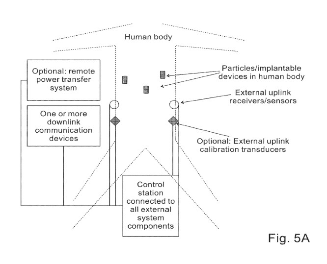
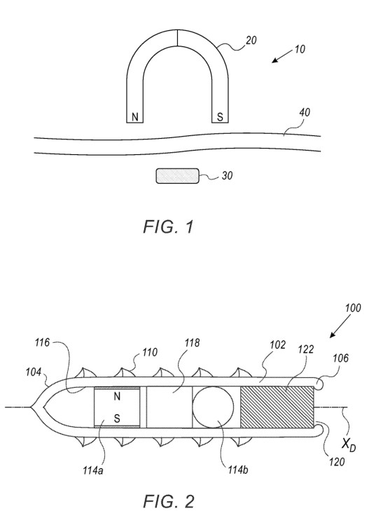

## Key Tenets

1. The operational region of the system is based on patient body size, such as for a human or a large animal
1. In an embodiment of the invention, a control system changes magnetic field amplitude to drive the motion of (micro)mechanical components of the internal device, generating forward, backward, stop-and-go, and complex 3D motion in homogeneous and heterogeneous matrices.

## Prior Art

### EP 4 082 467 A1

Describes the magnetic coils that would be used to control the nanobot

### US20200196995A1

### US20200108227A1

Smaller magnetic fins attached to the main body symmetrically all around its axis ( cylindrical symmetry ) ; where each fin has a fixed polarity, aligned with the polarity of the main - body of the particle , based on an embedded magnetic component in the fin with a sufficiently strong magnetic moment. Such fins can be produced, for example, from the elastomer films that are described in Mishra et al. , or alternatively by other suitable techniques known in the art . Such films comprise for example Fe304 magnetic nanoparticles ( MNPs ) and thermoplastic polyurethane ( TPU ) . The films are nanocomposites comprising the polymer and the magnetic nanoparticles . Assembly of the MNPs into chains causes a directional dependence in the magnetostatic energy , allowing for anisotropic actuation of the composite in 3D . The fins are attached to the main body with a flexible attachment point and / or are made of flexible material , so they can tilt or " flap ” when placed in an external magnetic field ( since they are magnetic , they can tilt to align with the external mag netic field ) ; in this case the main - body of the particle is also subject to a rotating torque aligning it with the external magnetic field ; since the body is larger than the fins it can tilt more slowly , subject to drag in viscoelastic media , allowing the fins to “ flap ” relative to the body

The solid particle body can range in size from a few nanometers to a few micrometers and exhibit specific and tunable magnetic properties . The adjustable magnetic features are diamagnetic , paramagnetic , superparamagnetic and ferromagnetic , depending on chemical composition , crystalline structure and size of the particles used . 

More specifically , representative examples of particle candidates include neodymium ( ex . , Nd2Fe14B ( “ A magnetic membrane actuator in composite technology utilizing diamagnetic levitation , ” IEEE Sens . J. 13 ( 2013 ) , pages 27862797 ) , carbon - coated Fe ( “ Microfabrication of magnetically actuated PDMS- Iron composite membranes , ” Microelectr .Engineer . 98 ( 2012 ) , pages 607-609 ) , iron ( II / III ) oxides( “ Magnetically - actuated artificial cilia for microfluidics propulsion , ” Lab Chip . 11 ( 2011 ) , pages 2002-2010 ) , cobalt alloy ( s ) ( “ A facile template - free approach to magnetodriven multifunctional artificial cilia , ” Appl . Mater . Interfaces 2( 2010 ) , pages 2226-2230 ) , etc. 

### US20210052330A1

### US20210052855A1

### US20210401526A1

### WO2021126905A1

- Miniature device may be configured such that the magnetic arrangement, within a rotating magnetic field, effects the propulsion of the miniature device within the patient, and, within a magnetic field gradient, effects the performance of the function
- Drive thread formed on an exterior surface thereof helically about the drive axis, the magnetic arrangement comprising a propulsion magnet rigidly connected to an interior surface thereof and disposed such that the vector of its magnetic moment, i.e., the orientation of its north and south poles, is disposed transverse to the drive axis
- Rack and pinion drive movement: rotation of the pinion gear about its rotation axis causes linear motion between it and the linear gear
- 