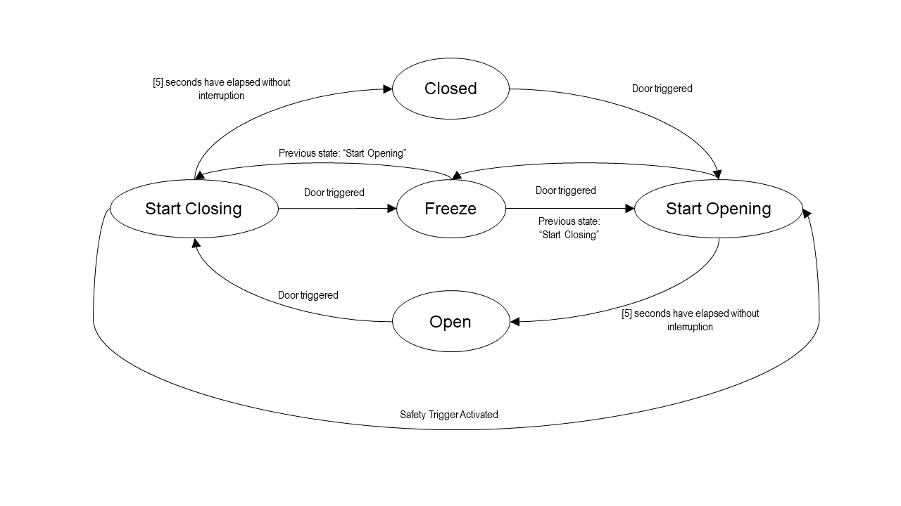

# Python Garage Door Solution

## Python Solution Docs

- To run program: (i) make sure `python3` is installed; (ii) navigate to the directory containing `main.py`; (iii) execute `python3 main.py`
- Door starts off in the closed state and by default takes 5 seconds (wall time) to open / close. These times are customizable parameters in the `__init__` method
- Input trigger for the garage door remote can be provided by typing any character or sequence on your keyboard and hitting `Enter`
- Safety function can be triggered by typing `safety` in the command line as the door is closing (i.e., `door.__current_state == Start_Closing`)
- Exit loop/program by typing `exit` in the command line

## How to run test cases

- Run `python3 Garage_Door_Tests.py`
- You should get the below outcome with 2/2 test cases passing

