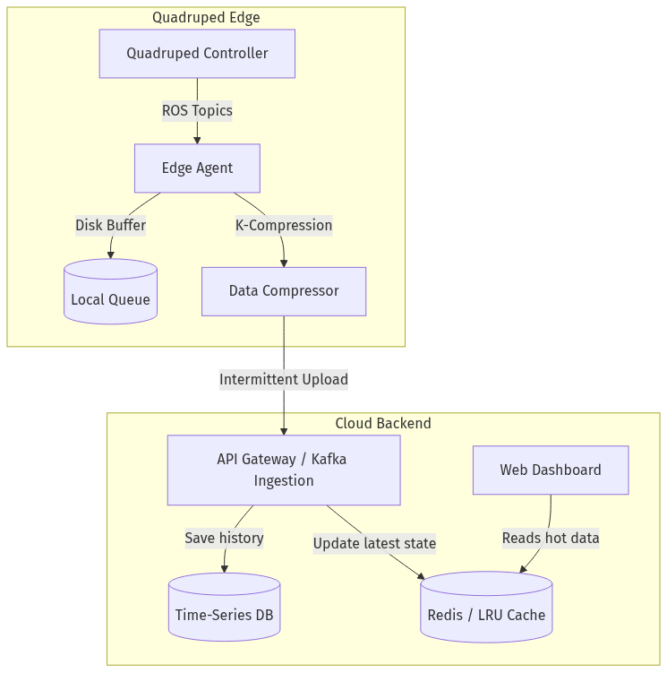
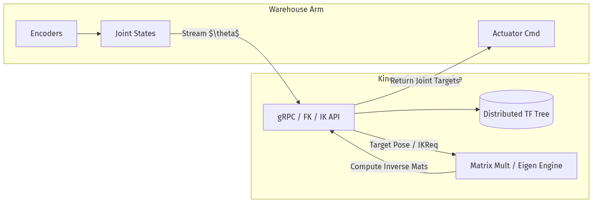
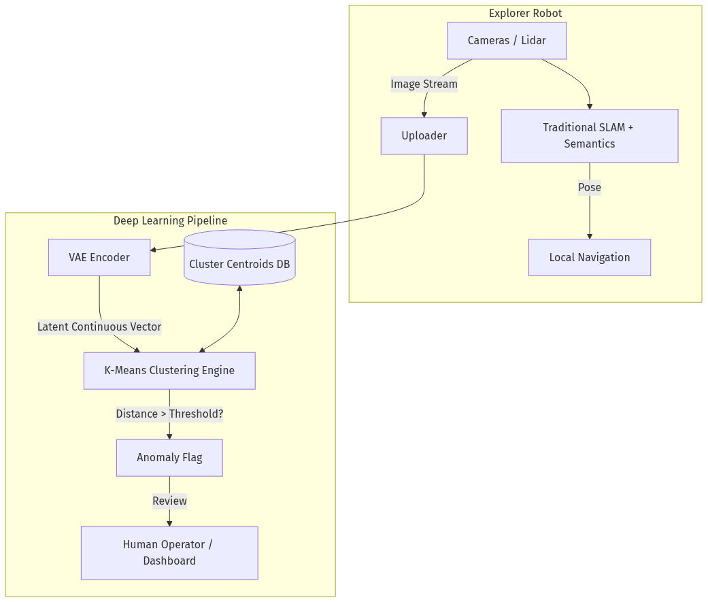
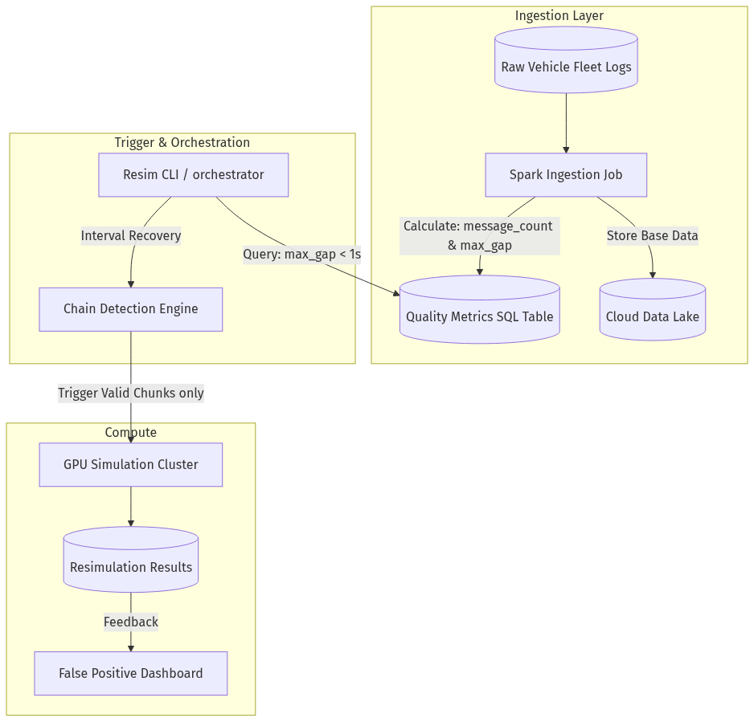

# Robotics System Design — Interview Question Bank

> **Format:** Whiteboard-style system design interview
> **Time per question:** ~45-60 minutes
> **Level:** Senior / Staff Robotics Software Engineer
> **Focus:** Distributed Systems, Data Pipelines, Algorithmic Robotics, and ML

---

## Question 1: Distributed Fleet Telemetry and Log Ingestion System

### Problem

You are tasked with designing a system that manages a global fleet of 10,000 quadruped inspection robots. These robots operate in disparate environments with highly intermittent cellular connectivity. The system needs to ingest live telemetry for dashboards, and upload heavy ROS logs for persistent storage and debugging.

**Part A (Edge Agent & Data Uploader, ~15 min)**
The quadruped controller produces high-frequency joint states and low-frequency system diagnostics via ROS. Design the edge agent responsible for the "Data Uploader." How do you handle intermittent internet without losing data? How do you prioritize live telemetry over massive log files?

**Part B (Log Compression, ~15 min)**
Discuss "K-compression" (Keyframe or Kinematic sub-sampling strategies) for robotics logs. How do you compress high-bandwidth topics like images or dense point clouds before uploading? What are the tradeoffs between lossless and lossy compression on edge hardware?

**Part C (Backend & Caching, ~20 min)**
Design the backend ingestion service. The central dashboard requires ultra-low latency access to the last known state (pose, battery, current task) of any robot. Explain how you would utilize an LRU (Least Recently Used) cache in this design. 

---

### A+ Response Benchmark

#### Part A — Edge Agent & Data Uploader
- **Architecture:** The candidate should propose a dedicated Edge Agent running alongside the core quadruped controller. It passively subscribes to ROS topics, isolating the critical control loop from networking tasks.
- **Queueing Mechanism:** Implement a local disk-backed queue (e.g., SQLite, Edge MQTT broker). When connection drops, messages are persisted to disk to prevent RAM overflow.
- **Priority QoS:** Telemetry (small, time-critical) gets high priority. Logs (massive, non-critical) are buffered and sent in chunks over low-priority background threads when bandwidth permits.
- **Bonus:** Mentions backpressure handling. If the disk fills up, the agent should dynamically drop old high-frequency debug data but retain low-frequency critical diagnostics.

#### Part B — Log Compression
- **Keyframe/Kinematic (K-Compression) Strategies:** Standard ROS bag compression uses LZ4/Zstandard, but candidates should discuss domain-specific strategies. For example, spatial/temporal decimation: saving "Keyframes" (K-frames) for video, or dropping joint states that haven't changed beyond a delta threshold.
- **Hardware Acceleration:** A+ candidates suggest using hardware encoders (e.g., NVENC on Jetson) for compressing image topics into H.264/H.265 streams rather than storing raw binaries.
- **Tradeoffs:** Lossy compression saves massive bandwidth but limits granular root-cause analysis during post-mortem debugging.

#### Part C — Backend & LRU Cache
- **Event Streaming:** Ingest data via an API Gateway/Load Balancer into an event stream like Apache Kafka.
- **LRU Cache Implementation:** The latest telemetry is written to a fast in-memory store like Redis, configured with an LRU eviction policy. 
- **The "Why":** A live dashboard only cares about the *current* state. Old telemetry wastes RAM. LRU naturally drops stale data (e.g., robots that are turned off) from the hot cache, while the backend writes full telemetry to a persistent Time-Series DB for historical queries.

#### Architecture (UML)

---

## Question 2: Cloud-Native Kinematics and Transform (TF) Service

### Problem

You are designing a centralized motion-planning and spatial-awareness backend for a massive automated warehouse. The warehouse contains thousands of robotic arms and mobile bases. The robots need a highly scalable way to query coordinate frame data and execute matrix math dynamically.

**Part A (TF Tree System, ~10 min)**
Explain how a TF (Transform) tree system works. How would you design a distributed, global TF tree that tracks the positions of all entities in the warehouse in real-time?

**Part B (Matrix Multiplication, ~15 min)**
Matrix multiplication is core to resolving coordinate frames. Explain the mathematical pipeline of getting an end-effector pose from a series of joint states. How would you scale this computation in the cloud?

**Part C (Implementing FK/IK, ~20 min)**
Design a Forward Kinematics (FK) and Inverse Kinematics (IK) microservice. If a robotic arm sends its current joint positions, how does the service compute the Forward Kinematics? Conversely, if it sends a target pose, how do you handle Inverse Kinematics?

---

### A+ Response Benchmark

#### Part A — Distributed TF Tree
- **Core Concept:** A TF tree represents frames (odometry, base_link, camera_link) in a Directed Acyclic Graph. 
- **Distributed Design:** Instead of standard ROS `tf2` which broadcasts via DDS to all nodes, a cloud implementation requires a centralized graph database (like Neo4j) or a fast key-value store mapping `Parent_Frame -> Child_Frame` transforms, updated at high frequency via WebSockets or gRPC from the robots.

#### Part B — Matrix Multiplication
- **Math Execution:** Each joint introduces a homogeneous transformation matrix (4x4, containing a 3x3 rotation and 3x1 translation). To calculate the final pose, the system multiplies the sequence of matrices: $T_{final} = T_1 \times T_2 \times ... \times T_n$.
- **Scale:** High-frequency, massive matrix multiplication across thousands of robots requires offloading calculations to GPU instances (via CUDA) or using highly optimized linear algebra C++ libraries (Eigen) wrapped in lightweight, concurrent microservices.

#### Part C — Implementing FK / IK
- **FK (Forward Kinematics):** Relatively trivial. The service receives joint angles $\theta$, plugs them into the Denavit-Hartenberg (DH) parameters or URDF matrices, multiplies them, and returns the $(x, y, z, roll, pitch, yaw)$ coordinates of the end-effector.
- **IK (Inverse Kinematics):** Highly non-linear and complex. A target pose is provided, and the service must find valid joint angles. 
- **A+ Implementation Details:** The candidate should mention that IK has multiple solutions. They should propose numerical solvers (like Jacobian Transpose or Levenberg-Marquardt) or analytical solvers (like IKFast) and discuss caching recent IK solutions to seed the numerical solver for faster convergence.

#### Architecture (UML)

---

## Question 3: Collaborative Mapping and Anomaly Detection Pipeline

### Problem

Your company is deploying autonomous exploration robots to map highly unstructured, dynamically changing subterranean environments. 

**Part A (SLAM vs Model, ~15 min)**
For edge navigation, the robots must localize themselves. Discuss the trade-offs between traditional geometric SLAM (Simultaneous Localization and Mapping) versus learned, end-to-end Neural Network models. When would you use one over the other?

**Part B (VAE Classes, ~15 min)**
To build a global topological map, the cloud needs to analyze the camera streams being ingested. Explain how you would use Variational Autoencoders (VAEs) to process these images. What is a latent space, and why are VAEs useful here?

**Part C (K-Means Clustering, ~15 min)**
Given the output from the VAE, design a system using K-Means clustering to automatically identify "anomalous" or "novel" environments that the robots discover, flagging them for human review.

---

### A+ Response Benchmark

#### Part A — SLAM vs Model
- **Traditional SLAM (e.g., ORB-SLAM, Lidar Cartographer):** 
    - *Pros:* Mathematically guaranteed consistency, explainable, runs fast on CPUs, highly accurate in texture-rich environments.
    - *Cons:* Fails easily in featureless corridors, shiny environments, or dynamic scenes (moving people).
- **Learned Models (e.g., Visual Odometry via CNNs/Transformers):**
    - *Pros:* Resilient to poor lighting, dynamic objects, and featureless terrains. Learns semantic context.
    - *Cons:* Opaque failure modes, computationally heavy (requires edge GPU/NPU), out-of-distribution environments break the prediction. 
- **A+ Conclusion:** Propose a hybrid system. Use Traditional SLAM as the core state estimator, tightly coupled with a learned model that provides semantic loop-closures or masks out dynamic obstacles.

#### Part B — VAE Classes and Latent Space
- **VAE Concept:** A VAE compresses a high-dimensional image (e.g., 1080p camera frame) into a low-dimensional "latent space" vector (e.g., a 128-dimensional array of floats) that encodes the core essence or "class" of the image. 
- **Why VAE:** Unlike standard autoencoders, the *Variational* aspect ensures the latent space is continuous and structured as a probability distribution. This is critical for clustering and ensuring that visually similar scenes map to geometrically close vectors.

#### Part C — K-Means Clustering for Anomalies
- **The Pipeline:** The VAE outputs a continuous stream of 128-D latent vectors into the cloud. The system runs K-Means in batch over historical data to identify distinct "clusters" of environments (e.g., Cluster 1 = Cave tunnels, Cluster 2 = Mine shafts).
- **Anomaly Detection:** When a new vector arrives from a robot, the system calculates its distance to the nearest K-Means centroid. If the distance exceeds a certain threshold (it doesn't belong to any known cluster), it is flagged as an "Anomaly" representing a novel unseen terrain type.
- **A+ Signal:** Mentioning the curse of dimensionality with K-Means. E.g., Euclidean distance becomes less meaningful in high dimensions (128-D), suggesting a need to constrain the VAE latent space size or use cosine similarity.

#### Architecture (UML)

---

## Question 4: Quality-Aware Data Ingestion Pipeline for AEB Resimulation

### Problem

Your ADAS engineering team runs massive cloud resimulations on fleet data to validate Automated Emergency Braking (AEB). Currently, 70% of GPU simulation jobs crash at runtime because the supposedly "valid" driving logs actually contain silent failures (e.g., missing 50 Hz CAN signals, empty log boundaries, or missing radar topics). 

**Part A (Failure Modes, ~10 min)**
Explain why validating data upload success at the file level is insufficient for active safety resimulation. What are the common data failure modes in vehicle logs that cause simulation stacks to crash?

**Part B (Quality Metrics Architecture, ~20 min)**
Design a quality-aware ingestion pipeline. How do you architect a system to ingest petabytes of ROS bags, extract quality metrics per segment, and make them queryable before kicking off a simulation stack? 

**Part C (Algorithm, ~15 min)**
Describe the specific metrics you would compute per segment to detect these data gaps. How do you implement "chain detection" to group consecutive valid segments and recover intervals from otherwise broken log files?

---

### A+ Response Benchmark

#### Part A — Failure Modes
- **File vs. Signal Validation:** The candidate must distinguish between file-level integrity (is the log corrupted?) and signal-level integrity (is the specific `vehicle_dynamics` topic present continuously?).
- **The Three Modes:** A+ candidates identify:
    1. **Signal gaps** (e.g., drive-by-wire dropping out for 2 seconds mid-drive, crashing the AEB TTC calc).
    2. **Empty boundaries** (initialization/shutdown sequences where sensors go silent but logs record).
    3. **Missing required topics** (a drive has perfect cameras but radar failed to record; the AEB needs both).
- **Safety Criticality:** They note that in active safety testing, the stack cannot "guess" or interpolate missing data (unless a strict fallback exists); the simulation MUST fail if inputs are missing.

#### Part B — Quality Metrics Architecture
- **Shift-Left Ingestion:** Quality assessment must move from *resimulation time* to *ingestion time*.
- **The Engine:** Data is ingested via Spark/Trino (or similar big data tools). During ingestion, jobs parse fixed-size log segments (e.g., 30s chunks), compute metrics, and store them in a fast queryable table (e.g., Apache Hudi or general SQL data warehouse).
- **The Trigger:** Before any GPU is spun up, a CLI or Orchestrator queries the metric table (`max_gap <= 1.0s` AND `message_count > 0` for all necessary topics). GPU slots are only allocated to valid slices of data.

#### Part C — Algorithm (Metrics & Chains)
- **The Core Metrics:** Two metrics per topic are necessary:
    1. `message_count` (is data present?)
    2. `max_inter_message_time_delta` (is data continuous?).
- **Chain Detection:** The pipeline queries the 30-second segments. If `Segment N` and `Segment N+1` both pass the threshold, they are "chained." 
- **Interval-Based Recovery:** Instead of throwing away a 1-hour log because of a 5-minute gap, interval recovery uses chain detection to extract the pristine data *before* the gap, and the pristine data *after* the gap, submitting them as independent simulation jobs. This exponentially increases usable data yield.

#### Architecture (UML)

