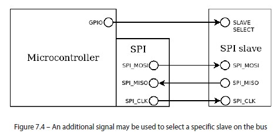
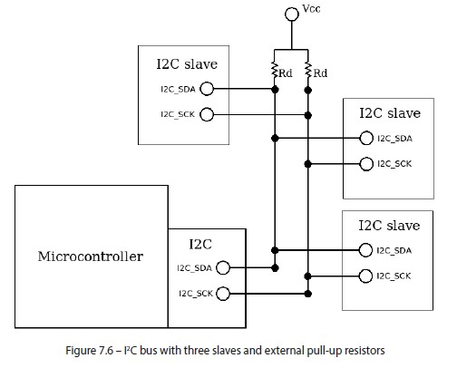
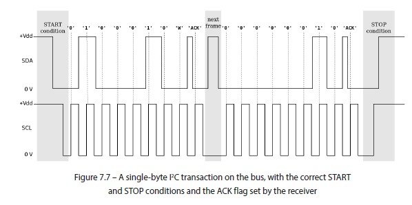
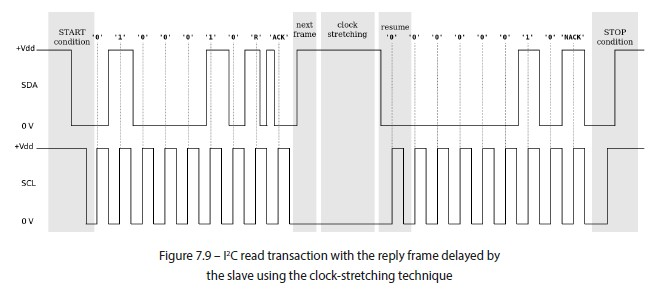
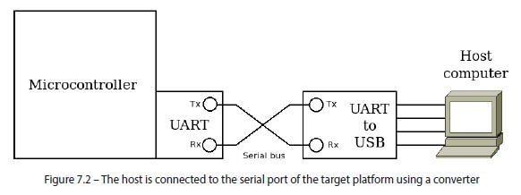

## Overview of communication protocols

### SPI

#### Overview

- Interface originally designed to control peripherals
- All the communication is always initiated by the master on the bus
- Full-duplex pin configuration (data can be transmitted in both directions on a signal carrier at the same time) and the synchronized clock, it may be much faster than asynchronous communication due to the better robustness to clock skews between the systems sharing the bus
- Multiple peripherals can share the same bus, as long as media access strategies are defined
- A common way for a master to control one peripheral at a time is by using separate GPIO lines to control the slave selection, although this does require an additional wire for each slave

#### Setup

A few predefined settings must be known in advance and shared between the master and all the slaves on the same bus:

- Clock polarity, indicating whether the clock tick corresponds to a raising or a falling edge of the clock
- Clock phase, indicating whether the clock idle position is high or low
- Length of the data packet, any value between 4 and 16 bits
- Bit order, indicating whether the data is transmitted starting from the most significant bit or the least significant bit

#### Operations

4-wire SPI devices have four signals:



| Wire | Signal |
|--|--|
| SPI CLK / SCLK | Clock |
| CS | Chip select |
| MOSI | main out, subnode in |
| MISO | main in, subnode out |

- To initiate the communication, the master must activate the clock, and may send a command sequence to the slave on the MOSI line. When the clock is detected, the slave can immediately start transferring bytes in the opposite direction using the MISO line.
- Even if the master has finished transmitting, it must comply with the protocol implemented by the slave and permit it to reply by keeping the clock alive for the duration of the transaction. The slave is given a predefined number of byte slots to communicate with the master.
- In order to keep the clock alive even when there is no data to transfer to the slave, the master can keep sending dummy bytes through the MOSI line, which are ignored by the slave. In the meantime, the slave is allowed to send data through the MISO line, as long as the master ensures that the clock keeps running. 

**Unlike UART** in the master-slave communication model implemented in the SPI, the slaves can never spontaneously initiate SPI communication, as the master is the only device on the bus allowed to transmit a clock. Each SPI transaction is self-contained, and at the end, the slave
is deselected by turning off the corresponding slave-select signal.

#### C Code

````c
uint8_t spi1_read(void) {
    volatile uint32_t reg;
    do {
        reg = SPI1_SR;
    } while ((reg & SPI_SR_RX_NOTEMPTY) == 0);
    return (uint8_t)SPI1_DR;
}
void spi1_write(const char byte) {
    int i;
    volatile uint32_t reg;
    SPI1_DR = byte;
    do {
        reg = SPI1_SR;
    } while ((reg & SPI_SR_TX_EMPTY) == 0);
}

int main () {
    slave_on();
    spi1_write(0x8F);
    b = spi1_read();
    spi1_write(0xFF);
    b = spi1_read();
    slave_off();
}
````


### I2C

#### Overview

- From the communication strategy point of view, this protocol shares some similarities with SPI. However, the default bit rate for I2C communication is much lower, as the protocol privileges lower-power consumption over throughput.
- The same two-wire bus can accommodate multiple participants, both masters and slaves, and there is no need for extra signals to physically select the slave of the transaction, as slaves have fixed logic addresses assigned
- One wire transports the clock generated by the master, and the other is used as a bidirectional synchronous data path. This is possible thanks to the unique mechanism of arbitration of the channel, which relies on the electronic design of the transceivers and may deal with the presence of multiple masters on the same bus in a very clean way




#### Setup 

- The synchronization between the master and slave is achieved by a recognizable `START` condition and a `STOP` condition, which determine the beginning and the end of a transaction, respectively
- Bus is initially idle, with both signals at the high logic state when all the participants are idling
- START condition is the only case when SDA is pulled low before SCL by the master

#### Operations

- Special condition communicates to slaves and other masters on the bus that a transaction is initiated
- `STOP` condition can be identified by the SDA transaction from a low to a high level, while the `SCL` remains high
- After a `STOP` condition, the bus is idle again, and initiating communication is only possible if a new `START` condition is transmitted
- A master sends a `START` condition by pulling `SDA` and `SCL` low in this order
- A frame is composed of nine clock periods
- After the edge of each clock pulse is raised, the level of `SDA` does not change until the clock is low again
- This allows us to transmit 1 frame of 8 bytes in the first 8 clock raise fronts
- During the last clock pulse, the master does not drive the `SDA` line, which is then held high by the pull-up resistor
- Any receiver that wants to acknowledge the reception of the frame can drive the signal low
- This condition on the ninth clock pulse is known as `ACK`
- If no receiving device acknowledges the frame, `SDA` remains high, and the sender understands that the frame did not reach the intended destination



#### Unique feature of I2C: Clock Stretching

- Even though not all devices support clock stretching, this mechanism is useful to complete transactions when the requested data is slightly late
- Clock stretching is a very unique feature of I2C, making it a very versatile protocol to communicate with sensors and other input peripherals
- It enables communication with slower devices that cannot provide the values to complete the transaction in time
- To enable this feature, SCL line must be bidirectional and the slave should be designed to access it to enforce a pull-down to keep the transaction alive while preparing the transfer of the next frame



### UART

#### Overview



#### Setup

- The bit rate, expressed in bits per second
- The number of data bits in each symbol (typically 8)
- The meaning of parity bit, if present (O is odd, E is even, and N is not present)
- The number of stop bits

#### Operations

- To initiate the transmission, the transceiver pulls the TX line down to the low logic level, for a period of time that is at least half of the bit sampling period depending on the bit rate
- The bits composing the byte being transferred are then translated into logical 0 or 1 values, which are held on the TX line for the time corresponding to each bit, according to the bit rate. After this start condition is easily recognized by the receiver, the bits composing the symbol follow in a specific order, from the least significant bit up to the most significant one
- The number of data bits composing the symbol is also configurable. The default data length of 8 bits allows each symbol to be converted into a byte
- At the end of the data, an optional parity bit can be configured to count the number of active bits, as a very simplistic form of a redundant check. The parity bit, if present, can be configured to indicate whether the number of 1 values in the symbol is odd or even
- While returning to the idle state, 1 or 2 stop bits must be used to indicate the end of the symbol
- A stop bit is transmitted by pulling the signal high for the entire duration of a bit transmission, marking the end of the current symbol, and forcing the receiver to initiate receiving the next one. A 1-stop bit is the most used default; the 1.5- and 2-stop bit settings provide a longer inter-symbol idling interval, which was useful in the past to communicate with slower, less responsive hardware but is rarely used today

### Other GPIO protocols
